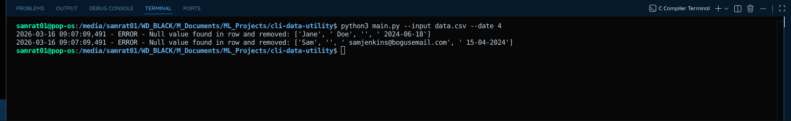

# CSV Data Utility

A professional **CLI tool** to clean and standardize CSV files automatically.  
It helps prepare messy CSV data for analysis or machine learning pipelines by:

- **Stripping** unnecessary whitespace from all fields
- **Removing** rows containing null or empty values
- **Standardizing** dates (reorders `DD-MM-YYYY` or `MM-DD-YYYY` to `YYYY-MM-DD`)
- **Normalizing** separators (converts `/` to `-`)
- **Separating** invalid rows into a dedicated discarded file while preserving headers

---

# Installation & Setup

Clone the repository and navigate to the project folder:

```bash
git clone https://github.com/SamratGhimire01/cli-data-utility.git
cd cli-data-utility
```

Create a virtual environment:

```bash
python3 -m venv venv
```

Activate the virtual environment:

Linux / macOS

```bash
source venv/bin/activate
```

Windows

```bash
venv\Scripts\activate
```

Install dependencies and the CLI command:

```bash
pip install -r requirements.txt
pip install -e .
```

---

# Visuals

## CLI Execution

Running the tool via the terminal.


---

## Data Transformation

Example of messy input being cleaned and standardized.



---

# Usage

Run the CLI command directly from your terminal:

```bash
csv-clean --input data.csv --output data/Updated_file.csv --dfile data/discarded_data.csv --date 4
```

---

# Command Arguments

| Argument | Description |
|--------|-------------|
| `--input` | Required: Path to the source CSV file |
| `--output` | Path where cleaned data will be saved (Default: `data/Updated_file.csv`) |
| `--dfile` | Path where invalid rows will be stored (Default: `data/discarded_data.csv`) |
| `--date` | Optional: The 1-based index of a specific date column to validate |

---

# Example

```bash
csv-clean \
--input data.csv \
--output data/clean_data.csv \
--dfile data/discarded_rows.csv \
--date 4
```

---

# Testing

Verify the cleaning logic and date reordering using the built-in test suite:

```bash
pytest tests/test_cleaner.py
```

---

# Author

Samrat Ghimire  
GitHub: https://github.com/SamratGhimire01